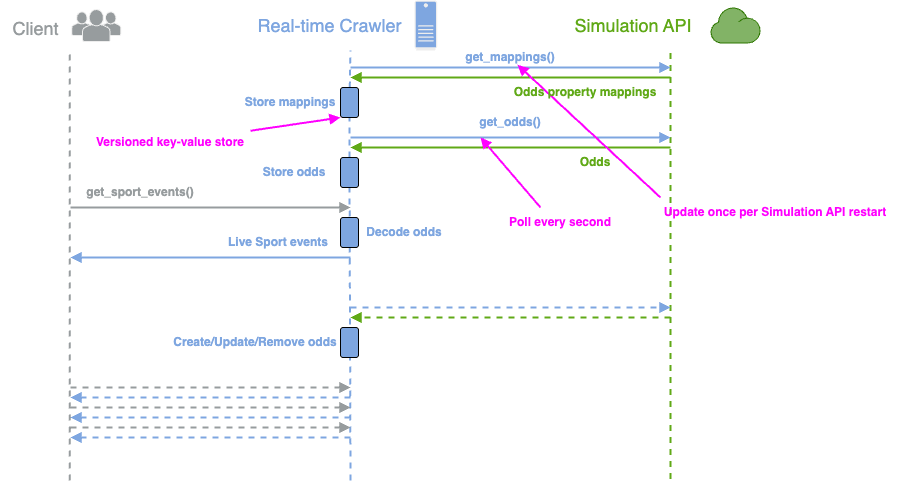

This guide explains how to run and debug the Dockerized Express server that connects to the simulation API.

## Contents

* [Sequence Diagram](#sequence-diagram)
* [Prerequisites](#prerequisites)
* [Project Structure](#project-structure)
* [Running the Application](#running-the-application)
  * [Option 1: Using Docker Compose (Recommended)](#option-1-using-docker-compose-recommended)
  * [Option 2: Standalone Docker](#option-2-standalone-docker)
  * [Option 3: Local development (Without Docker)](#option-3-local-development-without-docker)
* [Debugging](#debugging)
* [Testing](#testing)
* [Monitoring](#monitoring)
* [Cleanup](#cleanup)

## Sequence diagram




## Prerequisites
- Docker installed (version 20.10+)
- Docker Compose (version 1.29+)
- Node.js (version 18+) - only needed for local development without Docker

## Project Structure
```
src/
├── app.ts                        # Initializes services and server
├── app-config.ts                 # Defines application settings (API endpoints, polling interval) with env variable fallbacks
├── index.ts                      # Entry point of the application
├── client/
│   └── index.ts                  # Handles the /client/state endpoint; returns filtered state to clients
├── event-mapping-service.ts     # Fetches and applies mappings from /api/mappings; handles ID → name logic
├── logger.ts                    # Centralized logging utility for status/score changes and errors
├── polling-service.ts           # Coordinates regular polling (every 1000ms) of state and mappings
├── sport-events-service.ts      # Tracks internal state of all sport events (LIVE + PRE + REMOVED)
├── storage.ts                   # In-memory data storage
└── types.ts                     # Contains TypeScript types/interfaces for events, mappings, scores, etc.
```
## Running the Application

### Option 1: Using Docker Compose (Recommended)

1. Build and start all services:

```shell
docker-compose up --build
```

2. Access:

Express server: http://localhost:3001

Simulation API: http://localhost:3000


### Option 2: Standalone Docker

1. Build the image:

```shell
docker build -t express-server .
```


2. Run the container:

```shell
docker run -p 3001:3001 \
-e SPORT_EVENTS_API=http://host.docker.internal:3000/api/state \
-e MAPPINGS_API=http://host.docker.internal:3000/api/mappings \
express-server
```


### Option 3: Local development (Without Docker)
1. Install dependencies:

```shell
npm install
```

2. Build TypeScript:

```shell
npm run build
```

3. Start the server:

```shell
npm start
```

## Debugging
For Docker Compose:

```shell
docker-compose logs -f express-server
```

Starts the server in debug mode:

```shell
npm run start:debug
```

## Testing
```shell
npm test
```

## Monitoring

The application includes built-in memory monitoring that logs every 60 seconds:

```
  Memory usage:
  RSS: 120MB
  HeapTotal: 45MB
  HeapUsed: 30MB
```


## Cleanup

To stop and remove all containers:

```shell
docker-compose down
```

